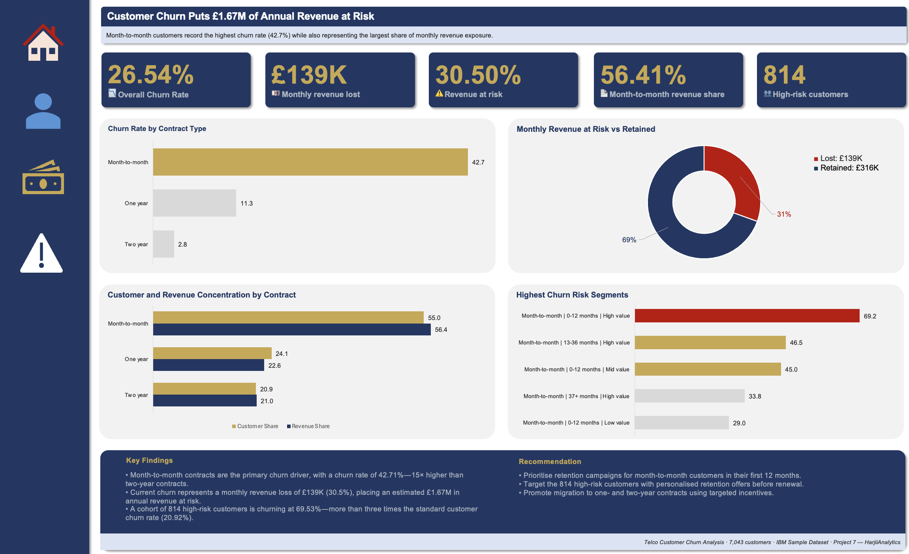
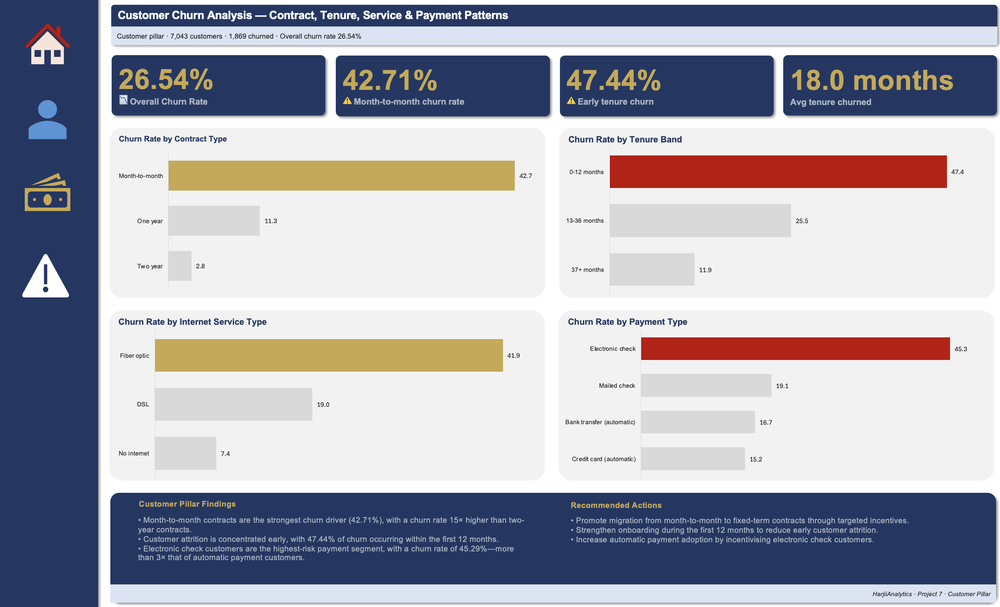
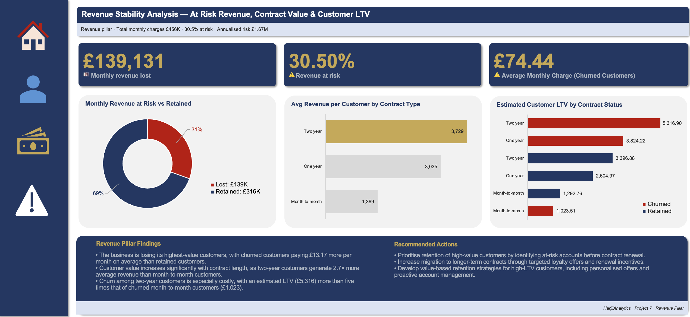
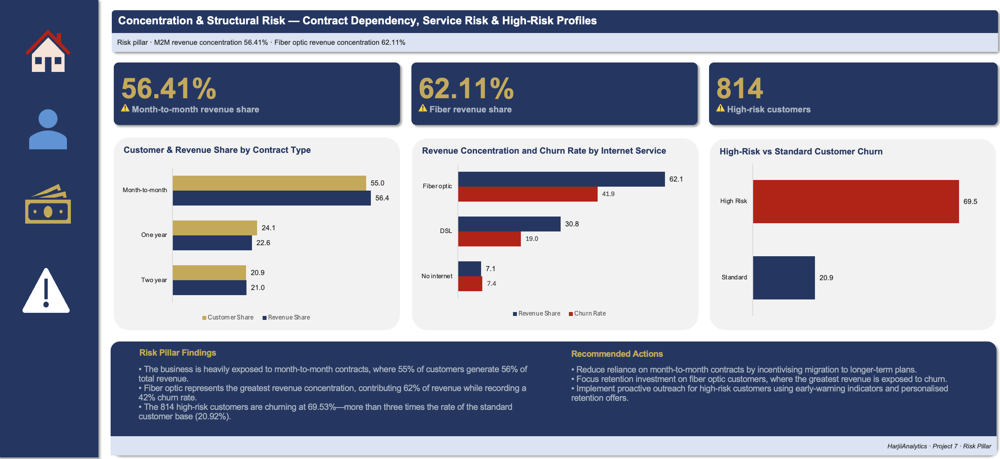

# 📊 End-to-End Telco Customer Churn Analysis | SQL + Excel Dashboard

An end-to-end customer churn analytics project using **MySQL** and **Microsoft Excel** to investigate customer retention, quantify revenue exposure, and identify structural business risks.

The project analyses the **IBM Telco Customer Churn** dataset through a complete analytics workflow—from database setup and SQL analysis to Excel dashboard development and business recommendations—using a three-pillar analytical framework:

- 👥 **Customer** — Who is churning and why?
- 💰 **Revenue** — What financial value is being lost?
- ⚠️ **Risk** — Where is the business structurally exposed?

The final deliverable is a four-dashboard executive reporting solution supported by **22 SQL queries**, **17 analysis-ready datasets**, **10 executive KPIs**, and **10 documented project phases**, demonstrating an end-to-end analytics workflow suitable for business stakeholders.

---

# 📌 Executive Summary

Customer churn affects **26.54%** of the customer base, placing approximately **£1.67 million** in annualised revenue at risk. However, the analysis shows that churn is not evenly distributed across the business.

The highest-risk customers are concentrated within **month-to-month contracts**, **early-tenure customers (0–12 months)**, **fiber optic subscribers**, and customers paying via **electronic check**. These segments consistently exhibit churn rates above 40%, significantly exceeding the overall average.

From a revenue perspective, the business faces a structural challenge. More than half of monthly revenue is generated by month-to-month customers, while fiber optic services contribute over 62% of total monthly revenue despite recording the highest churn rate. This concentration exposes a substantial portion of recurring revenue to customer attrition.

By combining SQL-driven analysis with executive dashboard reporting, the project transforms raw customer records into actionable business intelligence, helping decision-makers identify where retention initiatives can deliver the greatest commercial impact.

---

# 🖥️ Dashboard Preview

## Executive Summary Dashboard



Provides a high-level overview of customer churn, revenue exposure, and structural business risk through executive KPIs and supporting visualisations.

---

## Customer Dashboard



Examines customer behaviour across contract type, tenure, internet service, and payment method to identify the primary drivers of churn.

---

## Revenue Dashboard



Measures financial impact through revenue at risk, customer value, revenue concentration, and estimated lifetime value across customer segments.

---

## Risk Dashboard



Evaluates structural business risk by analysing revenue concentration, contract dependency, service concentration, and high-risk customer profiles.

---

# 🎯 Project Objectives

This project was designed to answer the following business questions:

- What is the overall customer churn rate?
- Which customer segments experience the highest churn?
- Which customer characteristics are most associated with churn?
- How much monthly and annual revenue is currently at risk?
- Which customer groups generate the greatest financial value?
- Which contract types provide the highest customer lifetime value?
- How concentrated is business revenue across contracts and services?
- Can high-risk customers be identified before they churn?
- Which customer segments should be prioritised for retention initiatives?
- What strategic actions could reduce churn and improve long-term revenue stability?

---

# 📂 Dataset Overview

| Attribute | Value |
|-----------|-------|
| Dataset | IBM Telco Customer Churn |
| Source | Kaggle |
| Original Publisher | BLASTCHAR (IBM Sample Data) |
| Records | 7,043 Customers |
| Features | 21 Columns |
| Database | MySQL |
| Analysis Tool | Microsoft Excel |
| Currency | GBP (£) |
| Project Type | End-to-End Customer Churn Analytics |

---

## Dataset Features

The dataset contains customer demographic information, subscription details, billing information, and churn status, including:

- Customer demographics
- Contract type
- Internet service
- Payment method
- Monthly charges
- Total charges
- Customer tenure
- Churn status

The data represents a static customer snapshot and is well suited for exploratory business analysis, customer segmentation, and executive reporting.

---

# 🛠️ Tech Stack

| Category | Tools |
|-----------|-------|
| Database | MySQL Workbench |
| Query Language | SQL |
| Data Cleaning | SQL |
| Data Validation | SQL |
| Data Analysis | SQL |
| Dashboard Development | Microsoft Excel |
| Data Visualisation | Excel Charts |
| Documentation | Markdown |
| Version Control | Git & GitHub |

---

## SQL Techniques

- CASE WHEN
- Common Table Expressions (CTEs)
- Window Functions
- GROUP BY
- Aggregate Functions
- RANK()
- ROW_NUMBER()
- LAG()
- PERCENT_RANK()
- SUM() OVER()
- STDDEV()

---

## Excel Features

- Structured Tables
- Cross-sheet Referencing
- KPI Framework Design
- Executive Dashboard Design
- Conditional Formatting
- Horizontal Bar Charts
- Doughnut Charts
- Clustered Bar Charts
- Manual Dashboard Layout
- Business Presentation Formatting

---

# 📈 Project Highlights

| Metric | Value |
|---------|------:|
| SQL Queries | 22 |
| SQL Files | 6 |
| CSV Exports | 17 |
| Excel Tables | 17 |
| Dashboard Sheets | 4 |
| Executive KPIs | 10 |
| Analytical Pillars | 3 |
| Project Phases | 10 |
| Dataset Size | 7,043 Customers |
| Churn Rate | 26.54% |
| Annualised Revenue at Risk | £1,669,570.20 |

---

# 🔄 Project Workflow

The project follows a structured end-to-end analytics workflow, beginning with database preparation and ending with a polished executive dashboard and repository documentation.

```text
Dataset
   │
   ▼
Phase 0 ─ Environment Setup
   │
   ▼
Phase 1 ─ SQL Extraction & Analysis
   │
   ▼
Phase 2 ─ Excel Import & Validation
   │
   ▼
Phase 3 ─ KPI Design & Framework
   │
   ▼
Phase 4 ─ Churn & Retention Analysis
   │
   ▼
Phase 5 ─ Revenue Stability Analysis
   │
   ▼
Phase 6 ─ Segment & Concentration Risk Analysis
   │
   ▼
Phase 7 ─ Dashboard Design & Documentation
   │
   ▼
Phase 8 ─ Business Insights & Recommendations
   │
   ▼
Phase 9 ─ README & Documentation
   │
   ▼
Phase 10 ─ Project Polish & Export
```

---

## Workflow Summary

| Phase | Description |
|--------|-------------|
| **Phase 0** | Prepared the MySQL environment, imported the dataset, validated data integrity, and cleaned missing values. |
| **Phase 1** | Performed SQL analysis to answer customer, revenue, and risk business questions using 22 analytical queries. |
| **Phase 2** | Imported SQL outputs into Excel, validated all datasets, and organised the workbook using structured tables. |
| **Phase 3** | Designed a KPI framework containing ten executive metrics across Customer, Revenue, and Risk pillars. |
| **Phase 4** | Built the Customer analytical layer and supporting churn analysis charts. |
| **Phase 5** | Built the Revenue analytical layer covering revenue exposure, customer value, and estimated lifetime value. |
| **Phase 6** | Built the Risk analytical layer focusing on revenue concentration and high-risk customer segments. |
| **Phase 7** | Designed and documented four executive dashboards using a consistent visual framework. |
| **Phase 8** | Converted analytical findings into business insights and actionable strategic recommendations. |
| **Phase 9** | Produced comprehensive project documentation covering workflow, repository structure, and technical implementation. |
| **Phase 10** | Performed final quality assurance, exported dashboard assets, and prepared the repository for publication. |

---

# 🖥️ Dashboard Tour

The project delivers four interconnected dashboards, each designed for a different level of business decision-making.

Rather than presenting isolated charts, the dashboards follow a progressive storytelling approach:

- **Executive Summary** — Provides an overview of business performance.
- **Customer** — Explains who is churning and the primary behavioural drivers.
- **Revenue** — Quantifies the financial impact of customer churn.
- **Risk** — Identifies structural weaknesses that threaten long-term revenue stability.

Together, the dashboards move from **"What is happening?"** to **"Why is it happening?"**, **"What is the financial impact?"**, and finally **"Where should the business act?"**

---

# 📊 Dashboard Overview

| Dashboard | Purpose | Primary Audience |
|------------|----------|------------------|
| Executive Summary | High-level business overview | Executives & Senior Management |
| Customer | Customer behaviour and churn drivers | Marketing & Customer Success |
| Revenue | Financial impact of churn | Finance & Commercial Teams |
| Risk | Structural concentration and business exposure | Leadership & Strategy Teams |

---

# 📋 Dashboard Sections

## 1️⃣ Executive Summary Dashboard


### Purpose

The Executive Summary Dashboard provides a concise overview of customer churn, financial exposure, and business risk through a single-page management report.

It brings together the project's most important KPIs and highlights the critical areas requiring executive attention.

### Dashboard Includes

- Executive KPI cards
- Overall churn overview
- Revenue at risk
- Customer concentration
- Revenue concentration
- High-level risk indicators
- Executive insight summary

### Business Questions Answered

- What is the current churn rate?
- How much revenue is at risk?
- Which customer segment drives the majority of churn?
- Which areas require immediate management attention?

---

## 2️⃣ Customer Dashboard


### Purpose

The Customer Dashboard investigates customer behaviour to determine which segments experience the highest churn and why.

It focuses on identifying behavioural patterns that can inform customer retention strategies.

### Dashboard Includes

- Churn by contract type
- Churn by tenure band
- Churn by internet service
- Churn by payment method
- Supporting KPI cards
- Customer insight summary

### Business Questions Answered

- Which customers churn the most?
- Does contract type influence churn?
- Does tenure affect customer retention?
- Which payment methods indicate elevated churn risk?
- Which internet services experience the greatest customer loss?

---

## 3️⃣ Revenue Dashboard


### Purpose

The Revenue Dashboard quantifies the financial consequences of customer churn by analysing revenue exposure, customer value, and lifetime value across customer segments.

The focus shifts from customer behaviour to commercial impact.

### Dashboard Includes

- Revenue at risk
- Revenue by contract
- Revenue by customer value tier
- Estimated lifetime value comparison
- Revenue KPI cards
- Revenue insight summary

### Business Questions Answered

- How much revenue is currently at risk?
- Which customers generate the highest financial value?
- Which contract types maximise customer lifetime value?
- Where should retention investment deliver the greatest return?

---

## 4️⃣ Risk Dashboard


### Purpose

The Risk Dashboard evaluates structural business exposure by identifying where customers and revenue are concentrated within the business.

Rather than focusing on historical churn alone, it highlights future operational vulnerability.

### Dashboard Includes

- Contract concentration analysis
- Internet service concentration analysis
- High-risk customer profile
- Risk KPI cards
- Executive risk summary

### Business Questions Answered

- How concentrated is revenue across contract types?
- Which services create the greatest financial dependency?
- Can high-risk customers be identified before churn occurs?
- Which structural risks threaten long-term business stability?

---

# 🎨 Dashboard Design Principles

A consistent visual language was applied across all dashboards to improve readability and support executive decision-making.

### Design Standards

- Consistent colour palette across all dashboards
- Standardised KPI cards
- Uniform typography and spacing
- Minimalist chart formatting
- Consistent chart titles
- Executive-friendly layouts
- Reduced visual clutter through selective use of legends, gridlines, and axes

### Analytical Framework

Every dashboard aligns with the project's three analytical pillars:

| Pillar | Business Focus |
|---------|----------------|
| 👥 Customer | Understand customer behaviour and churn drivers |
| 💰 Revenue | Quantify financial exposure and customer value |
| ⚠️ Risk | Assess structural business vulnerability and concentration |

This framework ensures every visual contributes directly to answering a business question rather than presenting descriptive statistics alone.

---

# 💡 Key Business Findings

The SQL analysis and Excel dashboards identified several critical patterns affecting customer retention, revenue stability, and long-term business performance.

---

## 👥 Customer Findings

### 1. Customer churn remains a significant business challenge.

- Overall churn rate: **26.54%**
- Nearly one in four customers has churned.

---

### 2. Month-to-month customers experience the highest churn.

- **42.71% churn rate**
- Represents the highest churn across all contract types.
- Contract flexibility appears strongly associated with customer attrition.

---

### 3. Early customer retention is the biggest opportunity.

Customers with **0–12 months** tenure recorded a:

- **47.44% churn rate**

Customer retention improves considerably as tenure increases, highlighting onboarding and early engagement as critical stages in the customer lifecycle.

---

### 4. Internet service influences churn behaviour.

Customers using **Fiber optic** services recorded:

- **41.89% churn rate**

This is substantially higher than DSL and customers without internet services, suggesting service-specific retention challenges.

---

### 5. Payment behaviour provides an early churn signal.

Customers paying via **Electronic Check** recorded:

- **45.29% churn rate**

making it the highest-risk payment method in the customer base.

---

# 💰 Revenue Findings

### 1. Customer churn places significant revenue at risk.

| Metric | Value |
|---------|------:|
| Monthly Revenue at Risk | **£139,130.85** |
| Annualised Revenue at Risk | **£1,669,570.20** |
| Revenue at Risk | **30.50%** |

Nearly one-third of recurring monthly revenue is associated with customers who churn.

---

### 2. Higher-value customers are more likely to churn.

Average monthly charges:

| Customer Status | Avg Monthly Charge |
|-----------------|-------------------:|
| Retained | £61.27 |
| Churned | £74.44 |

Customers who leave generate approximately **£13 more revenue per month** than retained customers.

---

### 3. Long-term contracts generate substantially greater customer value.

Average revenue per customer:

| Contract | Avg Revenue per Customer |
|-----------|-------------------------:|
| Two Year | £3,728.93 |
| One Year | £3,034.68 |
| Month-to-Month | £1,369.25 |

Although month-to-month contracts generate the highest monthly revenue because of their larger customer base, **two-year contracts create significantly greater long-term value on a per-customer basis**.

---

### 4. Customer lifetime value increases with contract commitment.

Estimated Lifetime Value (LTV):

| Contract | Estimated LTV |
|-----------|--------------:|
| Two Year (Churned) | £5,316.90 |
| One Year (Churned) | £3,824.22 |
| Month-to-Month (Churned) | £1,023.51 |

Long-term customer retention substantially increases overall customer value.

---

# ⚠️ Risk Findings

### 1. Revenue is concentrated within the highest-risk contract.

Month-to-month customers account for:

- **55.02% of customers**
- **56.41% of monthly revenue**

A significant proportion of recurring revenue depends on the customer segment most likely to churn.

---

### 2. Fiber optic services represent the largest concentration risk.

Fiber optic customers contribute:

- **62.11% of monthly revenue**
- **41.89% churn rate**

The business therefore faces both high revenue dependency and elevated churn within the same service category.

---

### 3. High-risk customers can be identified before churn occurs.

Customers meeting the following criteria:

- Month-to-month contract
- Monthly Charges > £70
- Tenure < 12 months

recorded:

- **814 customers**
- **69.53% churn rate**

These customers represent the highest-priority audience for proactive retention campaigns.

---

# 📌 Business Recommendations

The analysis suggests several practical actions that could reduce churn, improve customer retention, and strengthen long-term revenue stability.

---

## Recommendation 1 — Improve Early Customer Retention

Early-tenure customers (0–12 months) exhibit the highest churn rate.

Recommended initiatives include:

- Structured onboarding programmes
- First-year engagement campaigns
- Customer success check-ins
- Early satisfaction surveys

---

## Recommendation 2 — Encourage Long-Term Contract Adoption

Month-to-month customers experience substantially higher churn than customers on longer contracts.

Potential strategies include:

- Discounted annual plans
- Contract upgrade incentives
- Loyalty rewards
- Renewal promotions

---

## Recommendation 3 — Investigate Fiber Optic Customer Experience

Fiber optic services generate the largest share of revenue while also recording the highest churn.

Recommended actions include:

- Review service quality
- Investigate pricing competitiveness
- Analyse customer support interactions
- Conduct targeted customer feedback surveys

---

## Recommendation 4 — Target High-Value Customers Before Churn

Higher-paying customers contribute disproportionately to revenue loss.

Retention campaigns should prioritise:

- Premium customers
- Long-tenure customers
- Customers with increasing monthly charges
- Customers showing multiple risk indicators

---

## Recommendation 5 — Deploy Predictive Retention Programmes

High-risk customers can be identified using observable customer characteristics.

Businesses could implement:

- Customer risk scoring
- Automated retention workflows
- Personalised offers
- Early intervention campaigns

---

# 🛠️ SQL Techniques Applied

The analytical layer was developed entirely in SQL before being imported into Excel for reporting.

### Data Preparation

- Database creation
- Schema management
- Data validation
- Missing value handling
- Data type conversion

### Analytical Techniques

- CASE WHEN
- GROUP BY
- Aggregate Functions
- Common Table Expressions (CTEs)
- Window Functions
- RANK()
- ROW_NUMBER()
- SUM() OVER()
- LAG()
- PERCENT_RANK()
- STDDEV()

### SQL Deliverables

| Deliverable | Count |
|------------|------:|
| SQL Files | 6 |
| SQL Queries | 22 |
| CSV Outputs | 17 |

---

# 📊 Excel Features Applied

Excel served as the presentation and dashboard layer of the project.

### Workbook Development

- Structured Tables
- Cross-sheet Referencing
- KPI Framework
- Analysis Layers
- Dashboard Design
- Executive Reporting

### Dashboard Features

- KPI Cards
- Horizontal Bar Charts
- Clustered Bar Charts
- Doughnut Charts
- Executive Insight Panels
- Conditional Formatting
- Consistent Colour Theme
- Dashboard Navigation

### Design Principles

- SQL performs all computation.
- Excel presents business insights.
- No duplication of SQL logic.
- Executive-first dashboard design.
- Consistent formatting across all dashboards.

---

# 📁 Repository Structure

```text
Telco_Customer_Churn_Analysis/
│
├── data/
│   ├── churn_by_contract.csv
│   ├── churn_by_tenure_band.csv
│   ├── churn_by_internet_service.csv
│   ├── avg_tenure_by_churn.csv
│   ├── churn_by_payment_method.csv
│   ├── avg_charges_by_churn.csv
│   ├── revenue_at_risk.csv
│   ├── revenue_by_contract.csv
│   ├── revenue_tiers.csv
│   ├── cumulative_revenue_by_tenure.csv
│   ├── concentration_risk.csv
│   ├── internet_service_concentration.csv
│   ├── high_risk_customers.csv
│   ├── multi_dimension_churn.csv
│   ├── estimated_ltv.csv
│   ├── cohort_lag_analysis.csv
│   └── perfect_storm_churn.csv
│
├── dashboard/
│   ├── 01_executive_summary_dashboard.png
│   ├── 02_customer_dashboard.png
│   ├── 03_revenue_dashboard.png
│   └── 04_risk_dashboard.png
│
├── sql/
│   ├── 00_setup.sql
│   ├── 01a_exploration.sql
│   ├── 01b_customer.sql
│   ├── 01c_revenue.sql
│   ├── 01d_risk.sql
│   └── 01e_advanced.sql
│
├── doc/
│   ├── Phase_0_Environment_Setup.md
│   ├── Phase_1_SQL_Extraction_Analysis.md
│   ├── Phase_2_Excel_Import_Validation.md
│   ├── Phase_3_KPI_Framework.md
│   ├── Phase_4_Churn_Analysis.md
│   ├── Phase_5_Revenue_Stability.md
│   ├── Phase_6_Segment_Risk.md
│   ├── Phase_7_Dashboard_Documentation.md
│   ├── Phase_8_Business_Insights.md
│   ├── Phase_9_README_Documentation.md
│   └── Phase_10_Project_Polish_Export.md
│
├── Telco_Churn_Analysis.xlsx
├── README.md
├── DATA_DICTIONARY.md 
└── LICENSE
```

---

# ⭐ Project Highlights

- End-to-end analytics workflow from SQL to executive dashboard
- Three-pillar analytical framework (Customer · Revenue · Risk)
- 22 SQL queries answering core business questions
- 17 analysis-ready datasets exported from SQL
- Executive KPI framework supporting dashboard reporting
- Four professionally designed Excel dashboards
- Actionable business recommendations grounded in quantitative analysis
- Fully documented project workflow across ten implementation phases
- Repository structured for reproducibility and portfolio presentation

---

# 🚀 How to Reproduce This Project

Follow the steps below to recreate the complete analytical workflow.

## 1. Clone the Repository

```bash
git clone https://github.com/HarjiiBoss/Telco_Customer_Churn_Analysis.git
```

---

## 2. Download the Dataset

Download the **IBM Telco Customer Churn** dataset from Kaggle.

Dataset:
https://www.kaggle.com/datasets/blastchar/telco-customer-churn

Place the CSV file in your preferred working directory.

---

## 3. Create the Database

Open **MySQL Workbench** and run:

```sql
CREATE SCHEMA telco_churn;
```

Import the dataset into the newly created schema using the **Table Data Import Wizard**.

---

## 4. Run the SQL Scripts

Execute the SQL scripts in the following order:

```text
00_setup.sql
01a_exploration.sql
01b_customer.sql
01c_revenue.sql
01d_risk.sql
01e_advanced.sql
```

These scripts will:

- Validate the dataset
- Clean missing values
- Perform all analytical queries
- Generate the datasets used throughout the dashboard

---

## 5. Export SQL Outputs

Export each query result as a CSV file.

The completed project contains **17 analysis-ready CSV files** stored inside the **data/** folder.

---

## 6. Open the Excel Workbook

Open:

```text
Telco_Churn_Analysis.xlsx
```

The workbook contains:

- Source data tables
- KPI framework
- Analysis sheets
- Executive dashboards

Since SQL serves as the computation layer, Excel references the exported datasets without recalculating the core business metrics.

---

## 7. Review the Dashboards

Navigate through the dashboards in the following order:

1. Executive Summary
2. Customer
3. Revenue
4. Risk

Each dashboard builds upon the previous one to tell a complete business story from customer behaviour through financial impact and structural risk.

---

# 📚 Documentation

The project is fully documented to demonstrate both the analytical process and implementation workflow.

Documentation includes:

- Environment setup
- SQL analysis
- Excel modelling
- KPI framework
- Dashboard development
- Business insights
- Business recommendations
- Repository documentation
- Final project preparation

All documentation is available inside the **documentation/** folder.

---

# 🔮 Future Improvements

Several enhancements could further extend the analytical depth of this project.

## Deeper Customer Segmentation

Expand behavioural analysis using additional segmentation techniques such as:

- RFM Analysis (Recency, Frequency, Monetary)
- Cohort-based retention analysis
- Behavioural persona development

## Cohort & Tenure-Based Analysis

Extend the tenure-based findings into structured cohort tracking to observe:

- Retention curves by acquisition cohort
- Churn timing patterns within customer lifecycle stages
- Early-warning indicators by cohort segment

## Automated SQL Pipeline

Replace manual CSV exports with an automated ETL workflow connecting SQL directly to reporting tools.

## Interactive Dashboard

Develop a web-based interactive version of the dashboard using:

- Tableau
- Streamlit

## Time-Series Analysis

If longitudinal customer data becomes available, analyse:

- Monthly churn trends
- Seasonal churn patterns
- Customer retention cohorts
- Revenue forecasting

---

# 🎯 Skills Demonstrated

This project demonstrates practical experience across multiple areas of the data analytics lifecycle.

### SQL

- Database setup
- Data cleaning
- Data validation
- Exploratory analysis
- Business-focused SQL
- Window functions
- Common Table Expressions (CTEs)
- Advanced aggregations

### Microsoft Excel

- Structured workbook design
- KPI framework development
- Dashboard development
- Executive reporting
- Business storytelling
- Data visualisation
- Cross-sheet referencing
- Professional formatting

### Business Analytics

- Customer analytics
- Revenue analytics
- Risk analysis
- KPI design
- Executive dashboard development
- Insight generation
- Business recommendations

---

# 📖 Project Documentation

Every stage of the project has been documented to provide complete transparency and reproducibility.

| Phase | Description |
|--------|-------------|
| Phase 0 | Environment Setup |
| Phase 1 | SQL Extraction & Analysis |
| Phase 2 | Excel Import & Validation |
| Phase 3 | KPI Design & Framework |
| Phase 4 | Churn & Retention Analysis |
| Phase 5 | Revenue Stability Analysis |
| Phase 6 | Segment & Concentration Risk Analysis |
| Phase 7 | Dashboard Design & Documentation |
| Phase 8 | Business Insights & Recommendations |
| Phase 9 | README & Documentation |
| Phase 10 | Project Polish & Export |

---

# 👨‍💻 Author

**Salami Taofeek**

Data Analyst | SQL | Excel | BI

Passionate about transforming raw data into actionable business insights through analytical thinking, data visualisation, and executive reporting.

Feel free to connect or explore more of my work:

- GitHub: https://harjiiboss.github.io
- LinkedIn: https://www.linkedin.com/in/taofeek-salami-460a93245/

---

# 📄 License

This project is licensed under the **MIT License**.

You are welcome to use, study, or adapt the project for educational and portfolio purposes with appropriate attribution.

See the **LICENSE** file for full details.

---

# 🙏 Acknowledgements

Special thanks to:

- **IBM** for the original Telco Customer Churn sample dataset.
- **BLASTCHAR** for publishing the dataset on Kaggle.
- The open-source data community for promoting accessible datasets for analytics learning and portfolio development.

---

# ⭐ If You Found This Project Useful

If you found this project helpful or interesting:

- ⭐ Star the repository
- 🍴 Fork the project
- 💬 Share feedback or suggestions
- 🤝 Connect with me to discuss data analytics, SQL, Excel, or dashboard design

Thank you for taking the time to explore this project!

---
